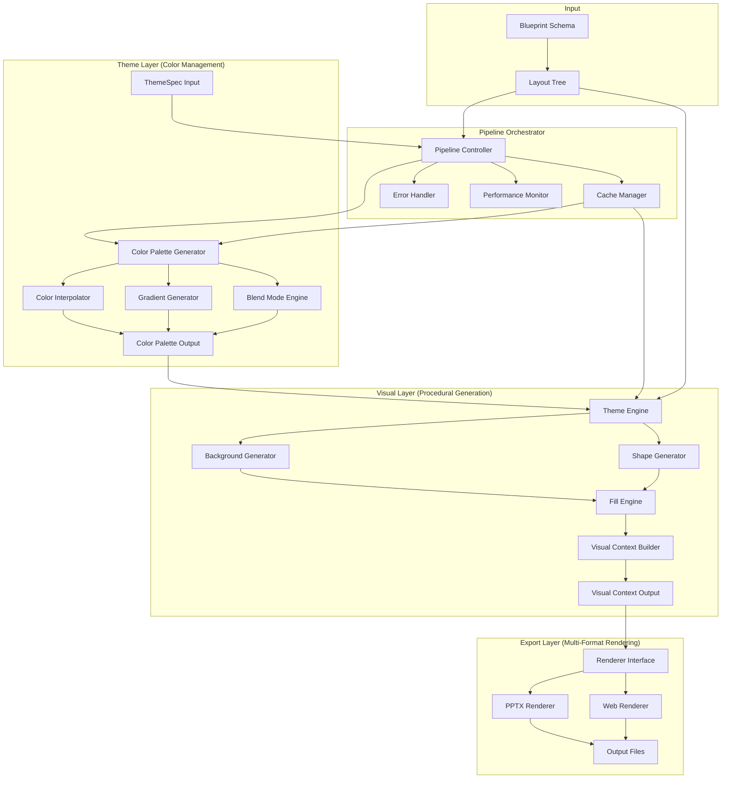
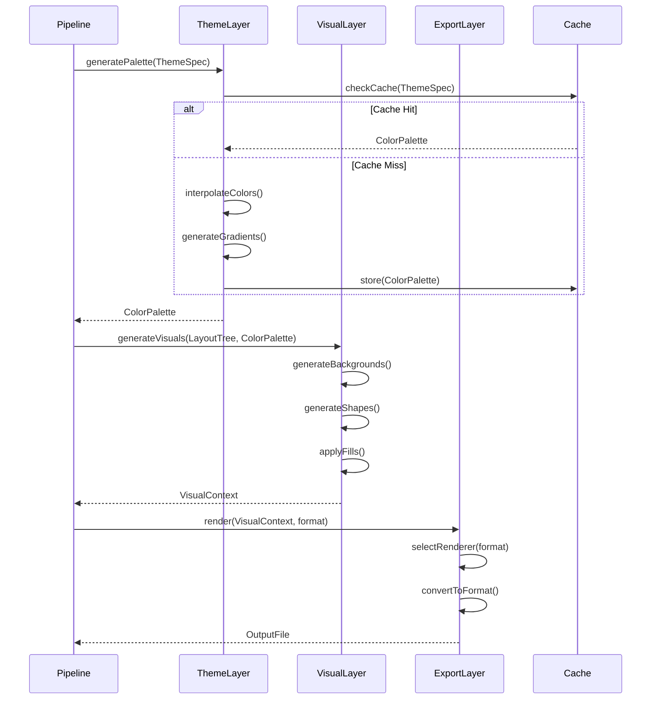

# Design Document: Layered Presentation Architecture

## Overview

This document specifies the design for implementing a three-layer architecture for Prezvik presentation generation. The architecture separates concerns into distinct layers: **Theme/Color Layer**, **Visual Generation Layer**, and **Export/Rendering Layer**. This separation enables procedural generation of backgrounds, gradients, shapes, and spacing rules on top of a constrained layout system, moving beyond template-based approaches to create a true theme engine.

### Current Architecture

The current Prezvik architecture follows this pipeline:

```
Blueprint (Schema) → Layout Engine → Theme Application → PPTX Renderer → Output File
```

**Current Components:**

- `@prezvik/schema`: Blueprint definitions
- `@prezvik/layout`: Layout tree generation and resolution
- `@prezvik/design`: Theme specifications (ThemeSpec, ThemeAgent)
- `@prezvik/renderer-pptx`: Direct PPTX rendering using PptxGenJS

**Current Limitations:**

1. **Monolithic rendering**: Theme application and PPTX rendering are tightly coupled
2. **Limited visual generation**: Backgrounds and decorations are hardcoded in renderer
3. **No intermediate representation**: Cannot cache or inspect visual elements before rendering
4. **Single output format**: Only PPTX is supported
5. **No procedural generation**: Visual elements are template-based, not algorithmically generated

### Proposed Architecture

The new layered architecture introduces clear separation of concerns:

```
Blueprint → Layout Tree → [Theme Layer] → [Visual Layer] → [Export Layer] → Output
                              ↓              ↓                ↓
                         Color Palette   Visual Context    PPTX/HTML/etc
```

**Key Improvements:**

1. **Theme Layer**: Centralized color management using Culori for CSS Color Level 4 support
2. **Visual Layer**: Procedural visual generation using Konva for canvas operations
3. **Export Layer**: Pluggable renderers (PPTX, web preview) with common interface
4. **Visual Context**: Intermediate representation enabling caching, debugging, and format-agnostic processing
5. **Pipeline Orchestrator**: Coordinates layer execution with error handling and performance monitoring

## Architecture

### High-Level Architecture Diagram



### Layer Responsibilities

#### Theme/Color Layer

**Purpose**: Centralized color management and palette generation

**Responsibilities:**

- Generate color palettes from base colors
- Interpolate between colors in perceptually uniform color spaces
- Create linear and radial gradients with configurable stops
- Apply blend modes (multiply, screen, overlay, etc.)
- Support CSS Color Level 4 formats (rgb, hsl, oklch, etc.)
- Resolve semantic color roles to concrete values

**Technology Choice**: **Culori**

- Comprehensive CSS Color Level 4 support
- Perceptually uniform color interpolation (OKLCH, LAB)
- Built-in gradient and blend mode support
- Active maintenance and TypeScript support
- Smaller bundle size than alternatives

#### Visual Generation Layer

**Purpose**: Procedural generation of backgrounds, shapes, and visual elements

**Responsibilities:**

- Generate procedural backgrounds based on theme specifications
- Create geometric shapes (rectangles, circles, polygons, paths)
- Apply fills (solid colors, patterns, gradients)
- Generate decoration shapes for hero slides
- Compute spacing rules based on theme
- Output Visual Context intermediate representation

**Technology Choice**: **Konva**

- Comprehensive shape creation API
- Native gradient support (linear and radial)
- Pattern fill support
- SVG export capability
- Better TypeScript support than Fabric.js
- Simpler API for programmatic generation

#### Export/Rendering Layer

**Purpose**: Convert Visual Context to output formats

**Responsibilities:**

- Define common Renderer interface
- Implement PPTX renderer using PptxGenJS
- Implement web preview renderer using Reveal.js
- Handle format-specific optimizations
- Validate output correctness

**Technology Choices**:

- **PptxGenJS**: Mature PowerPoint generation library with shape and theme support
- **Reveal.js**: Web presentation framework with extensive background support (color, image, video, gradients)

### Component Interaction Flow



## Components and Interfaces

### Theme Layer Components

#### ColorPaletteGenerator

**Purpose**: Generate color palettes from base colors and theme specifications

**Interface:**

```typescript
interface ColorPaletteGenerator {
  /**
   * Generate a complete color palette from a ThemeSpec
   * @param themeSpec - Theme specification with base colors
   * @returns ColorPalette with all semantic color roles resolved
   */
  generatePalette(themeSpec: ThemeSpec): ColorPalette;

  /**
   * Generate a color scale between two colors
   * @param startColor - Starting color in any CSS Color Level 4 format
   * @param endColor - Ending color in any CSS Color Level 4 format
   * @param steps - Number of intermediate colors to generate
   * @param colorSpace - Color space for interpolation (default: 'oklch')
   * @returns Array of interpolated colors
   */
  generateScale(startColor: string, endColor: string, steps: number, colorSpace?: ColorSpace): string[];
}
```

**Implementation Details:**

- Uses Culori's `interpolate()` function for perceptually uniform interpolation
- Supports OKLCH color space for perceptual uniformity
- Validates input colors and throws descriptive errors
- Caches generated palettes by ThemeSpec hash

#### GradientGenerator

**Purpose**: Create linear and radial gradients with configurable stops

**Interface:**

```typescript
interface GradientGenerator {
  /**
   * Generate a linear gradient definition
   * @param stops - Array of color stops with positions (0-1)
   * @param angle - Gradient angle in degrees (0 = left to right)
   * @returns LinearGradient definition
   */
  generateLinear(stops: ColorStop[], angle: number): LinearGradient;

  /**
   * Generate a radial gradient definition
   * @param stops - Array of color stops with positions (0-1)
   * @param center - Center point {x, y} in normalized coordinates (0-1)
   * @param radius - Radius in normalized units (0-1)
   * @returns RadialGradient definition
   */
  generateRadial(stops: ColorStop[], center: Point, radius: number): RadialGradient;
}

interface ColorStop {
  position: number; // 0-1
  color: string; // CSS Color Level 4 format
}

interface LinearGradient {
  type: "linear";
  angle: number;
  stops: ColorStop[];
}

interface RadialGradient {
  type: "radial";
  center: Point;
  radius: number;
  stops: ColorStop[];
}
```

**Implementation Details:**

- Uses Culori's gradient functions
- Normalizes stop positions to 0-1 range
- Validates stop ordering and color formats
- Supports CSS gradient syntax output

#### BlendModeEngine

**Purpose**: Apply blend modes to combine colors

**Interface:**

```typescript
interface BlendModeEngine {
  /**
   * Blend two colors using specified blend mode
   * @param baseColor - Base color
   * @param blendColor - Color to blend
   * @param mode - Blend mode (multiply, screen, overlay, etc.)
   * @param opacity - Blend opacity (0-1)
   * @returns Blended color
   */
  blend(baseColor: string, blendColor: string, mode: BlendMode, opacity?: number): string;
}

type BlendMode = "multiply" | "screen" | "overlay" | "darken" | "lighten" | "color-dodge" | "color-burn" | "hard-light" | "soft-light" | "difference" | "exclusion";
```

**Implementation Details:**

- Uses Culori's blend mode functions
- Converts colors to RGB for blending
- Supports alpha channel preservation
- Validates blend mode names

### Visual Layer Components

#### ThemeEngine

**Purpose**: Orchestrate procedural generation of backgrounds, shapes, and decorations

**Interface:**

```typescript
interface ThemeEngine {
  /**
   * Generate visual elements for a slide based on theme and layout
   * @param layoutNode - Root node of layout tree for the slide
   * @param colorPalette - Resolved color palette from Theme Layer
   * @param slideType - Type of slide (hero, section, content)
   * @param themeTone - Theme tone (executive, minimal, modern)
   * @returns Array of visual elements
   */
  generateVisuals(layoutNode: LayoutNode, colorPalette: ColorPalette, slideType: SlideType, themeTone: ThemeTone): VisualElement[];
}

type SlideType = "hero" | "section" | "content" | "closing";
type ThemeTone = "executive" | "minimal" | "modern";
```

**Implementation Details:**

- Delegates to BackgroundGenerator and ShapeGenerator
- Applies decoration rules based on slide type and theme tone
- Ensures decorations don't overlap with content areas
- Uses controlled randomness for variation

#### BackgroundGenerator

**Purpose**: Generate procedural backgrounds for slides

**Interface:**

```typescript
interface BackgroundGenerator {
  /**
   * Generate background for a slide
   * @param slideType - Type of slide
   * @param colorPalette - Available colors
   * @param dimensions - Slide dimensions
   * @returns Background visual element
   */
  generateBackground(slideType: SlideType, colorPalette: ColorPalette, dimensions: Dimensions): BackgroundElement;
}

interface BackgroundElement extends VisualElement {
  kind: "background";
  fill: SolidFill | GradientFill;
  dimensions: Dimensions;
}
```

**Implementation Details:**

- Hero slides: gradient backgrounds with 45° or 135° angles
- Section slides: solid or subtle gradients
- Content slides: minimal backgrounds (solid light color)
- Uses colors from ColorPalette based on slide type

#### ShapeGenerator

**Purpose**: Create geometric shapes for decorations

**Interface:**

```typescript
interface ShapeGenerator {
  /**
   * Generate decoration shapes for a slide
   * @param slideType - Type of slide
   * @param colorPalette - Available colors
   * @param contentBounds - Bounds of content area to avoid
   * @param themeTone - Theme tone for decoration style
   * @returns Array of shape elements
   */
  generateShapes(slideType: SlideType, colorPalette: ColorPalette, contentBounds: Rect[], themeTone: ThemeTone): ShapeElement[];
}

interface ShapeElement extends VisualElement {
  kind: "shape";
  shapeType: "rectangle" | "circle" | "polygon" | "line";
  bounds: Rect;
  fill: Fill;
  stroke?: Stroke;
  opacity: number;
}
```

**Implementation Details:**

- Uses Konva to create shapes
- Executive tone: rectangles and lines
- Minimal tone: circles and subtle shapes
- Modern tone: polygons and dynamic shapes
- Collision detection to avoid content overlap

#### FillEngine

**Purpose**: Apply fills to shapes and backgrounds

**Interface:**

```typescript
interface FillEngine {
  /**
   * Create a solid color fill
   */
  createSolidFill(color: string): SolidFill;

  /**
   * Create a gradient fill from gradient definition
   */
  createGradientFill(gradient: LinearGradient | RadialGradient): GradientFill;

  /**
   * Create a pattern fill
   */
  createPatternFill(pattern: Pattern): PatternFill;
}

type Fill = SolidFill | GradientFill | PatternFill;

interface SolidFill {
  type: "solid";
  color: string;
}

interface GradientFill {
  type: "gradient";
  gradient: LinearGradient | RadialGradient;
}

interface PatternFill {
  type: "pattern";
  pattern: Pattern;
}
```

**Implementation Details:**

- Converts gradient definitions to Konva gradient objects
- Supports pattern images and SVG patterns
- Validates fill parameters

#### VisualContextBuilder

**Purpose**: Construct the Visual Context intermediate representation

**Interface:**

```typescript
interface VisualContextBuilder {
  /**
   * Build Visual Context from layout tree and visual elements
   * @param layoutTree - Resolved layout tree
   * @param visualElements - Generated visual elements per slide
   * @param colorPalette - Color palette used
   * @returns Complete Visual Context
   */
  build(layoutTree: LayoutTree[], visualElements: VisualElement[][], colorPalette: ColorPalette): VisualContext;
}
```

**Implementation Details:**

- Merges layout nodes with visual elements
- Preserves layout tree structure
- Includes metadata for debugging
- Validates completeness

### Export Layer Components

#### Renderer Interface

**Purpose**: Define common interface for all renderers

**Interface:**

```typescript
interface Renderer {
  /**
   * Render Visual Context to output format
   * @param visualContext - Complete visual context
   * @param options - Renderer-specific options
   * @returns Path to output file or buffer
   */
  render(visualContext: VisualContext, options?: RenderOptions): Promise<RenderResult>;

  /**
   * Validate that Visual Context can be rendered
   * @param visualContext - Visual context to validate
   * @returns Validation result with errors if any
   */
  validate(visualContext: VisualContext): ValidationResult;

  /**
   * Get supported features for this renderer
   * @returns Feature support matrix
   */
  getSupportedFeatures(): FeatureSupport;
}

interface RenderOptions {
  outputPath?: string;
  quality?: "low" | "medium" | "high";
  [key: string]: any; // Renderer-specific options
}

interface RenderResult {
  success: boolean;
  outputPath?: string;
  buffer?: Buffer;
  errors?: string[];
  warnings?: string[];
}

interface ValidationResult {
  valid: boolean;
  errors: string[];
  warnings: string[];
}

interface FeatureSupport {
  gradients: boolean;
  patterns: boolean;
  blendModes: boolean;
  customShapes: boolean;
  [key: string]: boolean;
}
```

#### PPTXRenderer

**Purpose**: Render Visual Context to PowerPoint format

**Interface:**

```typescript
class PPTXRenderer implements Renderer {
  constructor(private pptxGen: PptxGenJS);

  async render(
    visualContext: VisualContext,
    options?: PPTXRenderOptions
  ): Promise<RenderResult>;

  validate(visualContext: VisualContext): ValidationResult;

  getSupportedFeatures(): FeatureSupport;

  /**
   * Convert Visual Context gradient to PptxGenJS gradient
   */
  private convertGradient(gradient: LinearGradient | RadialGradient): any;

  /**
   * Convert Visual Context shape to PptxGenJS shape
   */
  private convertShape(shape: ShapeElement): any;
}

interface PPTXRenderOptions extends RenderOptions {
  layout?: 'LAYOUT_16x9' | 'LAYOUT_4x3';
  author?: string;
  title?: string;
  subject?: string;
}
```

**Implementation Details:**

- Uses PptxGenJS shape API for geometric shapes
- Converts gradients to PptxGenJS gradient format
- Applies theme colors to master slide
- Supports PowerPoint built-in shapes
- Handles text rendering from layout nodes

#### WebRenderer

**Purpose**: Render Visual Context to HTML slides for web preview

**Interface:**

```typescript
class WebRenderer implements Renderer {
  constructor(private framework: 'reveal' | 'slidev');

  async render(
    visualContext: VisualContext,
    options?: WebRenderOptions
  ): Promise<RenderResult>;

  validate(visualContext: VisualContext): ValidationResult;

  getSupportedFeatures(): FeatureSupport;

  /**
   * Convert Visual Context to HTML/CSS
   */
  private generateHTML(visualContext: VisualContext): string;

  /**
   * Generate CSS for gradients and styles
   */
  private generateCSS(visualContext: VisualContext): string;
}

interface WebRenderOptions extends RenderOptions {
  theme?: string;
  transition?: string;
  controls?: boolean;
  progress?: boolean;
}
```

**Implementation Details:**

- Generates Reveal.js HTML structure
- Converts gradients to CSS linear-gradient/radial-gradient
- Converts shapes to SVG elements
- Supports color, image, and video backgrounds
- Includes responsive design considerations

## Data Models

### ColorPalette

**Purpose**: Store resolved colors for all semantic roles

```typescript
interface ColorPalette {
  /** Palette version for schema evolution */
  version: "1.0";

  /** Semantic color roles */
  primary: string;
  secondary: string;
  accent: string;

  /** Background colors */
  lightBg: string;
  darkBg: string;

  /** Text colors */
  textOnDark: string;
  textOnLight: string;
  mutedOnDark: string;
  mutedOnLight: string;

  /** Generated color scales */
  scales?: {
    [key: string]: string[]; // e.g., 'primary': ['#001', '#002', ..., '#009']
  };

  /** Metadata */
  metadata: {
    colorSpace: ColorSpace;
    generatedAt: string; // ISO timestamp
    themeSpecHash: string; // For cache invalidation
  };
}

type ColorSpace = "rgb" | "hsl" | "oklch" | "lab";
```

### VisualContext

**Purpose**: Intermediate representation containing all visual elements for rendering

```typescript
interface VisualContext {
  /** Schema version */
  version: "1.0";

  /** Slides with visual elements */
  slides: SlideVisualContext[];

  /** Color palette used */
  colorPalette: ColorPalette;

  /** Global theme settings */
  theme: {
    tone: ThemeTone;
    typography: ThemeTypography;
  };

  /** Metadata */
  metadata: {
    generatedAt: string;
    layoutTreeHash: string;
    themeSpecHash: string;
  };
}

interface SlideVisualContext {
  /** Slide identifier */
  slideId: string;

  /** Slide type */
  type: SlideType;

  /** Slide dimensions */
  dimensions: Dimensions;

  /** Background element */
  background: BackgroundElement;

  /** Decoration shapes */
  decorations: ShapeElement[];

  /** Content elements from layout tree */
  content: ContentElement[];
}

interface Dimensions {
  width: number;
  height: number;
}

interface Point {
  x: number;
  y: number;
}

interface Rect {
  x: number;
  y: number;
  width: number;
  height: number;
}
```

### VisualElement

**Purpose**: Base type for all visual elements

```typescript
interface VisualElement {
  /** Unique identifier */
  id: string;

  /** Element kind */
  kind: "background" | "shape" | "text" | "image";

  /** Z-index for layering */
  zIndex: number;

  /** Opacity (0-1) */
  opacity: number;
}

interface BackgroundElement extends VisualElement {
  kind: "background";
  fill: Fill;
  dimensions: Dimensions;
}

interface ShapeElement extends VisualElement {
  kind: "shape";
  shapeType: "rectangle" | "circle" | "polygon" | "line" | "path";
  bounds: Rect;
  fill?: Fill;
  stroke?: Stroke;

  /** Shape-specific properties */
  properties?: {
    // For rectangles
    cornerRadius?: number;

    // For circles
    radius?: number;

    // For polygons
    points?: Point[];

    // For paths
    pathData?: string; // SVG path data
  };
}

interface ContentElement extends VisualElement {
  kind: "text" | "image";
  bounds: Rect;

  /** Content-specific properties */
  content: TextContent | ImageContent;
}

interface TextContent {
  text: string;
  font: string;
  fontSize: number;
  color: string;
  align: "left" | "center" | "right";
  verticalAlign: "top" | "middle" | "bottom";
  bold?: boolean;
  italic?: boolean;
}

interface ImageContent {
  src: string; // URL or data URI
  fit: "cover" | "contain" | "fill";
}

interface Stroke {
  color: string;
  width: number;
  dashArray?: number[]; // For dashed lines
}
```

### LayoutTree

**Purpose**: Positioned node tree from layout engine (existing structure)

```typescript
interface LayoutTree {
  root: LayoutNode;
  metadata: {
    slideId: string;
    slideType: string;
  };
}

interface LayoutNode {
  type: string;
  _rect: Rect; // Computed position and size
  children?: LayoutNode[];

  // Content properties
  text?: string;
  image?: string;

  // Style properties (to be enhanced by Visual Layer)
  style?: {
    backgroundColor?: string;
    textColor?: string;
    fontSize?: number;
    fontFamily?: string;
  };
}
```

### ThemeSpec

**Purpose**: Theme specification input (existing structure, enhanced)

```typescript
interface ThemeSpec {
  /** Color palette definition */
  palette: ThemePalette;

  /** Typography settings */
  typography: ThemeTypography;

  /** Per-slide theme specifications */
  slideRhythm: SlideTheme[];

  /** Theme tone */
  tone: ThemeTone;

  /** Procedural generation settings */
  generation?: {
    /** Enable procedural backgrounds */
    proceduralBackgrounds: boolean;

    /** Enable decoration shapes */
    decorationShapes: boolean;

    /** Randomness seed for reproducibility */
    seed?: number;

    /** Decoration density (0-1) */
    decorationDensity: number;
  };
}

interface ThemePalette {
  primary: string;
  secondary: string;
  accent: string;
  lightBg: string;
  darkBg: string;
  textOnDark: string;
  textOnLight: string;
  mutedOnDark: string;
  mutedOnLight: string;
}

interface ThemeTypography {
  displayFont: string;
  bodyFont: string;
}

interface SlideTheme {
  slideId: string;
  backgroundMode: "dark" | "light";
  accentColor: string;
  headerStyle: "band" | "none";
  decorations: Decoration[];
}

type Decoration = { kind: "left-bar"; color: string; width: number } | { kind: "oval"; x: number; y: number; w: number; h: number; color: string; opacity: number } | { kind: "bottom-bar"; color: string; height: number } | { kind: "corner-accent"; position: "top-right" | "top-left"; color: string };
```

### Pattern

**Purpose**: Define pattern fills for shapes

```typescript
interface Pattern {
  /** Pattern type */
  type: "image" | "svg" | "dots" | "lines" | "grid";

  /** Pattern source (for image/svg) */
  src?: string;

  /** Pattern repeat mode */
  repeat: "repeat" | "repeat-x" | "repeat-y" | "no-repeat";

  /** Pattern scale */
  scale?: number;

  /** Pattern-specific properties */
  properties?: {
    // For dots
    dotSize?: number;
    dotSpacing?: number;
    dotColor?: string;

    // For lines
    lineWidth?: number;
    lineSpacing?: number;
    lineAngle?: number;
    lineColor?: string;

    // For grid
    gridSize?: number;
    gridColor?: string;
  };
}
```

## Pipeline Orchestration

### Pipeline Controller

**Purpose**: Coordinate execution of all three layers with error handling and performance monitoring

```typescript
class PipelineController {
  constructor(
    private themeLayer: ThemeLayerFacade,
    private visualLayer: VisualLayerFacade,
    private exportLayer: ExportLayerFacade,
    private cacheManager: CacheManager,
    private performanceMonitor: PerformanceMonitor,
  ) {}

  /**
   * Execute the complete pipeline
   * @param layoutTrees - Resolved layout trees for all slides
   * @param themeSpec - Theme specification
   * @param outputFormat - Desired output format
   * @param options - Pipeline options
   * @returns Pipeline result with output path
   */
  async execute(layoutTrees: LayoutTree[], themeSpec: ThemeSpec, outputFormat: OutputFormat, options: PipelineOptions = {}): Promise<PipelineResult> {
    const startTime = Date.now();

    try {
      // Phase 1: Theme Layer
      this.performanceMonitor.startPhase("theme");
      const colorPalette = await this.executeThemeLayer(themeSpec);
      this.performanceMonitor.endPhase("theme");

      // Phase 2: Visual Layer
      this.performanceMonitor.startPhase("visual");
      const visualContext = await this.executeVisualLayer(layoutTrees, colorPalette, themeSpec);
      this.performanceMonitor.endPhase("visual");

      // Phase 3: Export Layer
      this.performanceMonitor.startPhase("export");
      const renderResult = await this.executeExportLayer(visualContext, outputFormat, options.renderOptions);
      this.performanceMonitor.endPhase("export");

      const totalTime = Date.now() - startTime;

      return {
        success: true,
        outputPath: renderResult.outputPath,
        visualContext: options.includeVisualContext ? visualContext : undefined,
        performance: this.performanceMonitor.getReport(),
        totalTime,
      };
    } catch (error) {
      return this.handleError(error, startTime);
    }
  }

  /**
   * Execute Theme Layer with caching
   */
  private async executeThemeLayer(themeSpec: ThemeSpec): Promise<ColorPalette> {
    const cacheKey = this.cacheManager.hashThemeSpec(themeSpec);

    // Check cache
    const cached = this.cacheManager.get<ColorPalette>("palette", cacheKey);
    if (cached) {
      console.log("[Pipeline] Using cached color palette");
      return cached;
    }

    // Generate palette
    console.log("[Pipeline] Generating color palette...");
    const palette = await this.themeLayer.generatePalette(themeSpec);

    // Cache result
    this.cacheManager.set("palette", cacheKey, palette);

    return palette;
  }

  /**
   * Execute Visual Layer with caching
   */
  private async executeVisualLayer(layoutTrees: LayoutTree[], colorPalette: ColorPalette, themeSpec: ThemeSpec): Promise<VisualContext> {
    console.log("[Pipeline] Generating visual elements...");

    const slides: SlideVisualContext[] = [];

    for (const layoutTree of layoutTrees) {
      const slideTheme = themeSpec.slideRhythm.find((st) => st.slideId === layoutTree.metadata.slideId);

      if (!slideTheme) {
        throw new Error(`No slide theme found for slide: ${layoutTree.metadata.slideId}`);
      }

      const slideVisuals = await this.visualLayer.generateSlideVisuals(layoutTree, colorPalette, slideTheme, themeSpec.tone);

      slides.push(slideVisuals);
    }

    return {
      version: "1.0",
      slides,
      colorPalette,
      theme: {
        tone: themeSpec.tone,
        typography: themeSpec.typography,
      },
      metadata: {
        generatedAt: new Date().toISOString(),
        layoutTreeHash: this.cacheManager.hashLayoutTrees(layoutTrees),
        themeSpecHash: this.cacheManager.hashThemeSpec(themeSpec),
      },
    };
  }

  /**
   * Execute Export Layer
   */
  private async executeExportLayer(visualContext: VisualContext, outputFormat: OutputFormat, renderOptions?: RenderOptions): Promise<RenderResult> {
    console.log(`[Pipeline] Rendering to ${outputFormat}...`);

    const renderer = this.exportLayer.getRenderer(outputFormat);

    // Validate before rendering
    const validation = renderer.validate(visualContext);
    if (!validation.valid) {
      throw new Error(`Visual Context validation failed: ${validation.errors.join(", ")}`);
    }

    // Render
    const result = await renderer.render(visualContext, renderOptions);

    if (!result.success) {
      throw new Error(`Rendering failed: ${result.errors?.join(", ")}`);
    }

    return result;
  }

  /**
   * Handle pipeline errors
   */
  private handleError(error: any, startTime: number): PipelineResult {
    const totalTime = Date.now() - startTime;
    const currentPhase = this.performanceMonitor.getCurrentPhase();

    console.error(`[Pipeline] Error in ${currentPhase} phase:`, error);

    return {
      success: false,
      error: {
        message: error.message,
        phase: currentPhase,
        stack: error.stack,
      },
      performance: this.performanceMonitor.getReport(),
      totalTime,
    };
  }
}

type OutputFormat = "pptx" | "html" | "pdf";

interface PipelineOptions {
  renderOptions?: RenderOptions;
  includeVisualContext?: boolean;
  mode?: "legacy" | "layered"; // For migration
}

interface PipelineResult {
  success: boolean;
  outputPath?: string;
  visualContext?: VisualContext;
  error?: {
    message: string;
    phase: string;
    stack?: string;
  };
  performance: PerformanceReport;
  totalTime: number;
}
```

### Layer Facades

**Purpose**: Provide simplified interfaces to each layer for the pipeline

```typescript
class ThemeLayerFacade {
  constructor(
    private paletteGenerator: ColorPaletteGenerator,
    private gradientGenerator: GradientGenerator,
    private blendModeEngine: BlendModeEngine,
  ) {}

  async generatePalette(themeSpec: ThemeSpec): Promise<ColorPalette> {
    return this.paletteGenerator.generatePalette(themeSpec);
  }
}

class VisualLayerFacade {
  constructor(
    private themeEngine: ThemeEngine,
    private visualContextBuilder: VisualContextBuilder,
  ) {}

  async generateSlideVisuals(layoutTree: LayoutTree, colorPalette: ColorPalette, slideTheme: SlideTheme, themeTone: ThemeTone): Promise<SlideVisualContext> {
    const slideType = layoutTree.metadata.slideType as SlideType;
    const dimensions = { width: 960, height: 540 }; // 16:9 default

    // Generate visual elements
    const visualElements = this.themeEngine.generateVisuals(layoutTree.root, colorPalette, slideType, themeTone);

    // Separate elements by type
    const background = visualElements.find((e) => e.kind === "background") as BackgroundElement;
    const decorations = visualElements.filter((e) => e.kind === "shape") as ShapeElement[];
    const content = this.convertLayoutToContent(layoutTree.root);

    return {
      slideId: layoutTree.metadata.slideId,
      type: slideType,
      dimensions,
      background,
      decorations,
      content,
    };
  }

  private convertLayoutToContent(node: LayoutNode): ContentElement[] {
    const elements: ContentElement[] = [];

    if (node.text) {
      elements.push({
        id: `text-${Math.random()}`,
        kind: "text",
        zIndex: 10,
        opacity: 1,
        bounds: node._rect,
        content: {
          text: node.text,
          font: node.style?.fontFamily || "Calibri",
          fontSize: node.style?.fontSize || 14,
          color: node.style?.textColor || "#000000",
          align: "left",
          verticalAlign: "top",
        },
      });
    }

    if (node.image) {
      elements.push({
        id: `image-${Math.random()}`,
        kind: "image",
        zIndex: 10,
        opacity: 1,
        bounds: node._rect,
        content: {
          src: node.image,
          fit: "cover",
        },
      });
    }

    // Recursively process children
    if (node.children) {
      for (const child of node.children) {
        elements.push(...this.convertLayoutToContent(child));
      }
    }

    return elements;
  }
}

class ExportLayerFacade {
  private renderers: Map<OutputFormat, Renderer>;

  constructor() {
    this.renderers = new Map();
    this.renderers.set("pptx", new PPTXRenderer(new PptxGenJS()));
    this.renderers.set("html", new WebRenderer("reveal"));
  }

  getRenderer(format: OutputFormat): Renderer {
    const renderer = this.renderers.get(format);
    if (!renderer) {
      throw new Error(`No renderer available for format: ${format}`);
    }
    return renderer;
  }
}
```

### Cache Manager

**Purpose**: Manage caching of expensive operations

```typescript
class CacheManager {
  private cache: Map<string, CacheEntry>;
  private maxSize: number;
  private ttl: number; // Time to live in milliseconds

  constructor(maxSize: number = 100, ttl: number = 3600000) {
    this.cache = new Map();
    this.maxSize = maxSize;
    this.ttl = ttl;
  }

  /**
   * Get cached value
   */
  get<T>(namespace: string, key: string): T | undefined {
    const cacheKey = `${namespace}:${key}`;
    const entry = this.cache.get(cacheKey);

    if (!entry) {
      return undefined;
    }

    // Check expiration
    if (Date.now() - entry.timestamp > this.ttl) {
      this.cache.delete(cacheKey);
      return undefined;
    }

    return entry.value as T;
  }

  /**
   * Set cached value
   */
  set<T>(namespace: string, key: string, value: T): void {
    const cacheKey = `${namespace}:${key}`;

    // Evict oldest entry if cache is full
    if (this.cache.size >= this.maxSize) {
      const oldestKey = this.cache.keys().next().value;
      this.cache.delete(oldestKey);
    }

    this.cache.set(cacheKey, {
      value,
      timestamp: Date.now(),
    });
  }

  /**
   * Hash ThemeSpec for cache key
   */
  hashThemeSpec(themeSpec: ThemeSpec): string {
    return this.hash(JSON.stringify(themeSpec));
  }

  /**
   * Hash LayoutTrees for cache key
   */
  hashLayoutTrees(layoutTrees: LayoutTree[]): string {
    return this.hash(JSON.stringify(layoutTrees));
  }

  /**
   * Simple hash function
   */
  private hash(str: string): string {
    let hash = 0;
    for (let i = 0; i < str.length; i++) {
      const char = str.charCodeAt(i);
      hash = (hash << 5) - hash + char;
      hash = hash & hash; // Convert to 32-bit integer
    }
    return hash.toString(36);
  }

  /**
   * Clear cache
   */
  clear(): void {
    this.cache.clear();
  }
}

interface CacheEntry {
  value: any;
  timestamp: number;
}
```

### Performance Monitor

**Purpose**: Track execution time for each layer and provide performance reports

```typescript
class PerformanceMonitor {
  private phases: Map<string, PhaseMetrics>;
  private currentPhase: string | null;
  private phaseStartTime: number;

  constructor() {
    this.phases = new Map();
    this.currentPhase = null;
    this.phaseStartTime = 0;
  }

  /**
   * Start timing a phase
   */
  startPhase(phase: string): void {
    this.currentPhase = phase;
    this.phaseStartTime = Date.now();
  }

  /**
   * End timing a phase
   */
  endPhase(phase: string): void {
    if (this.currentPhase !== phase) {
      console.warn(`[PerformanceMonitor] Phase mismatch: expected ${this.currentPhase}, got ${phase}`);
      return;
    }

    const duration = Date.now() - this.phaseStartTime;

    const existing = this.phases.get(phase);
    if (existing) {
      existing.count++;
      existing.totalTime += duration;
      existing.avgTime = existing.totalTime / existing.count;
      existing.maxTime = Math.max(existing.maxTime, duration);
      existing.minTime = Math.min(existing.minTime, duration);
    } else {
      this.phases.set(phase, {
        count: 1,
        totalTime: duration,
        avgTime: duration,
        maxTime: duration,
        minTime: duration,
      });
    }

    this.currentPhase = null;
  }

  /**
   * Get current phase
   */
  getCurrentPhase(): string {
    return this.currentPhase || "unknown";
  }

  /**
   * Get performance report
   */
  getReport(): PerformanceReport {
    const report: PerformanceReport = {
      phases: {},
    };

    for (const [phase, metrics] of this.phases.entries()) {
      report.phases[phase] = { ...metrics };
    }

    return report;
  }

  /**
   * Reset metrics
   */
  reset(): void {
    this.phases.clear();
    this.currentPhase = null;
  }
}

interface PhaseMetrics {
  count: number;
  totalTime: number;
  avgTime: number;
  maxTime: number;
  minTime: number;
}

interface PerformanceReport {
  phases: {
    [phase: string]: PhaseMetrics;
  };
}
```

## Migration Strategy

### Migration Phases

The migration from the current monolithic architecture to the layered architecture will follow a phased approach to minimize risk and maintain backward compatibility.

#### Phase 1: Foundation (Weeks 1-2)

**Goal**: Establish core infrastructure without breaking existing functionality

**Tasks:**

1. Create new package structure:
   - `@prezvik/theme-layer`: Theme/Color Layer implementation
   - `@prezvik/visual-layer`: Visual Generation Layer implementation
   - `@prezvik/export-layer`: Export/Rendering Layer implementation
   - `@prezvik/pipeline`: Pipeline orchestration

2. Install dependencies:
   - Add `culori` to `@prezvik/theme-layer`
   - Add `konva` to `@prezvik/visual-layer`
   - Keep existing `pptxgenjs` in `@prezvik/renderer-pptx`

3. Implement data models:
   - Define `ColorPalette` interface
   - Define `VisualContext` interface
   - Define `VisualElement` types

4. Create pipeline controller with dual-mode support:
   - `mode: 'legacy'` - uses existing `@prezvik/renderer-pptx` directly
   - `mode: 'layered'` - uses new three-layer architecture

**Success Criteria:**

- All existing tests pass
- New packages build successfully
- Pipeline controller can execute in legacy mode

#### Phase 2: Theme Layer Implementation (Weeks 3-4)

**Goal**: Implement Theme Layer and integrate with existing ThemeSpec

**Tasks:**

1. Implement `ColorPaletteGenerator`:
   - Use Culori for color interpolation
   - Generate color scales
   - Support OKLCH color space

2. Implement `GradientGenerator`:
   - Linear gradients with configurable angles
   - Radial gradients with center points
   - Color stop validation

3. Implement `BlendModeEngine`:
   - Support common blend modes (multiply, screen, overlay)
   - Alpha channel handling

4. Integrate with existing `ThemeAgent`:
   - Enhance `ThemeSpec` with generation settings
   - Use Theme Layer to resolve colors

5. Add caching:
   - Cache color palettes by ThemeSpec hash
   - Implement cache invalidation

**Success Criteria:**

- Theme Layer generates valid `ColorPalette` from `ThemeSpec`
- Color interpolation produces perceptually uniform results
- Gradients render correctly in test outputs
- Cache reduces redundant color generation

#### Phase 3: Visual Layer Implementation (Weeks 5-7)

**Goal**: Implement Visual Layer for procedural generation

**Tasks:**

1. Implement `ThemeEngine`:
   - Orchestrate background and shape generation
   - Apply decoration rules based on slide type

2. Implement `BackgroundGenerator`:
   - Hero slides: gradient backgrounds
   - Section slides: solid or subtle gradients
   - Content slides: minimal backgrounds

3. Implement `ShapeGenerator`:
   - Create geometric shapes using Konva
   - Collision detection to avoid content overlap
   - Theme-specific decoration styles

4. Implement `FillEngine`:
   - Solid color fills
   - Gradient fills (linear and radial)
   - Pattern fills

5. Implement `VisualContextBuilder`:
   - Merge layout nodes with visual elements
   - Validate completeness
   - Add metadata

**Success Criteria:**

- Visual Layer generates complete `VisualContext`
- Backgrounds vary appropriately by slide type
- Decorations don't overlap with content
- Visual Context can be serialized to JSON

#### Phase 4: Export Layer Implementation (Weeks 8-9)

**Goal**: Implement Export Layer with PPTX and web renderers

**Tasks:**

1. Define `Renderer` interface:
   - `render()` method
   - `validate()` method
   - `getSupportedFeatures()` method

2. Implement `PPTXRenderer`:
   - Convert `VisualContext` to PptxGenJS calls
   - Map gradients to PptxGenJS gradient format
   - Map shapes to PptxGenJS shapes
   - Preserve text and image content from layout

3. Implement `WebRenderer`:
   - Generate Reveal.js HTML structure
   - Convert gradients to CSS
   - Convert shapes to SVG
   - Support responsive design

4. Refactor existing `@prezvik/renderer-pptx`:
   - Extract reusable logic
   - Maintain backward compatibility

**Success Criteria:**

- `PPTXRenderer` produces valid PPTX files
- `WebRenderer` produces valid HTML slides
- Output quality matches or exceeds current renderer
- All existing PPTX tests pass

#### Phase 5: Integration and Testing (Weeks 10-11)

**Goal**: Integrate all layers and validate end-to-end

**Tasks:**

1. Implement `PipelineController`:
   - Execute all three layers in sequence
   - Error handling and recovery
   - Performance monitoring

2. Update `generateDeck()` function:
   - Add `mode` parameter (legacy/layered)
   - Default to legacy mode initially
   - Log which mode is active

3. Comprehensive testing:
   - Unit tests for each layer
   - Integration tests for pipeline
   - Property-based tests for Visual Context serialization
   - Visual regression tests comparing legacy vs layered output

4. Performance optimization:
   - Profile each layer
   - Optimize bottlenecks
   - Validate performance requirements

**Success Criteria:**

- End-to-end pipeline executes successfully
- Performance meets requirements (< 5s for 10 slides)
- Visual output quality is equivalent or better
- All tests pass in both modes

#### Phase 6: Gradual Rollout (Weeks 12-14)

**Goal**: Gradually transition to layered mode

**Tasks:**

1. Enable layered mode for new presentations:
   - Add feature flag to enable layered mode
   - Monitor error rates and performance

2. A/B testing:
   - Generate presentations in both modes
   - Compare output quality
   - Gather user feedback

3. Fix issues:
   - Address bugs found in production
   - Refine visual generation algorithms
   - Optimize performance

4. Full migration:
   - Switch default mode to layered
   - Deprecate legacy mode
   - Remove legacy code after grace period

**Success Criteria:**

- Layered mode is stable in production
- Error rates are acceptable
- User feedback is positive
- Performance is acceptable

### Backward Compatibility Strategy

**Dual-Mode Pipeline:**

```typescript
// In @prezvik/core/src/deck.ts
export async function generateDeck(schema: any, outputPath: string = "output.pptx", options: GenerateDeckOptions = {}): Promise<void> {
  const mode = options.mode || "legacy"; // Default to legacy initially

  console.log(`[generateDeck] Using ${mode} mode`);

  if (mode === "legacy") {
    return generateDeckLegacy(schema, outputPath, options);
  } else {
    return generateDeckLayered(schema, outputPath, options);
  }
}

interface GenerateDeckOptions {
  mode?: "legacy" | "layered";
  theme?: string;
  includeVisualContext?: boolean;
}
```

**Legacy Mode Implementation:**

```typescript
async function generateDeckLegacy(schema: any, outputPath: string, options: GenerateDeckOptions): Promise<void> {
  // Existing implementation
  const themeAgent = new ThemeAgent();
  const themeSpec = await themeAgent.generateTheme(schema, {
    fallbackTheme: options.theme || "executive",
  });

  const layouts = schema.slides.map((slide: any) => {
    const strategy = layoutRegistry.get(slide.type);
    const tree = strategy(slide);
    const polished = polishLayout(tree);
    return resolveLayout(polished);
  });

  await renderPPTXToFile(layouts, outputPath, themeSpec);
}
```

**Layered Mode Implementation:**

```typescript
async function generateDeckLayered(schema: any, outputPath: string, options: GenerateDeckOptions): Promise<void> {
  // New layered implementation
  const themeAgent = new ThemeAgent();
  const themeSpec = await themeAgent.generateTheme(schema, {
    fallbackTheme: options.theme || "executive",
  });

  const layouts = schema.slides.map((slide: any) => {
    const strategy = layoutRegistry.get(slide.type);
    const tree = strategy(slide);
    const polished = polishLayout(tree);
    return resolveLayout(polished);
  });

  // Use new pipeline
  const pipeline = new PipelineController(new ThemeLayerFacade(/* ... */), new VisualLayerFacade(/* ... */), new ExportLayerFacade());

  const result = await pipeline.execute(layouts, themeSpec, "pptx", {
    renderOptions: { outputPath },
    includeVisualContext: options.includeVisualContext,
  });

  if (!result.success) {
    throw new Error(`Pipeline failed: ${result.error?.message}`);
  }
}
```

### Migration Risks and Mitigations

| Risk                                 | Impact | Mitigation                                                  |
| ------------------------------------ | ------ | ----------------------------------------------------------- |
| **Breaking changes to existing API** | High   | Maintain dual-mode support with legacy as default           |
| **Performance regression**           | Medium | Profile and optimize each layer; cache expensive operations |
| **Visual output differences**        | Medium | Visual regression testing; A/B comparison                   |
| **Dependency conflicts**             | Low    | Use workspace protocol; pin versions                        |
| **Increased complexity**             | Medium | Clear documentation; gradual rollout                        |
| **Cache invalidation bugs**          | Medium | Comprehensive cache key hashing; TTL limits                 |

## Error Handling

### Error Categories

The layered architecture introduces multiple points of failure. Errors are categorized by layer and severity.

#### Theme Layer Errors

**Color Parsing Errors:**

- **Cause**: Invalid color format in ThemeSpec
- **Severity**: High (blocks pipeline)
- **Handling**: Validate colors on input; provide descriptive error with expected formats
- **Recovery**: Fall back to default color palette

**Color Space Conversion Errors:**

- **Cause**: Unsupported color space or conversion failure
- **Severity**: Medium
- **Handling**: Log warning; fall back to RGB color space
- **Recovery**: Continue with RGB interpolation

**Gradient Generation Errors:**

- **Cause**: Invalid stop positions or missing colors
- **Severity**: Medium
- **Handling**: Validate stops before generation; clamp positions to 0-1
- **Recovery**: Use solid color fill instead of gradient

#### Visual Layer Errors

**Shape Generation Errors:**

- **Cause**: Invalid bounds or shape parameters
- **Severity**: Medium
- **Handling**: Validate shape parameters; skip invalid shapes
- **Recovery**: Continue without decoration shapes

**Collision Detection Errors:**

- **Cause**: Unable to find non-overlapping position
- **Severity**: Low
- **Handling**: Log warning; place shape anyway or skip
- **Recovery**: Continue with overlapping shapes or no decorations

**Canvas Rendering Errors:**

- **Cause**: Konva initialization failure or memory issues
- **Severity**: High (blocks visual generation)
- **Handling**: Catch Konva errors; provide fallback
- **Recovery**: Generate minimal Visual Context without procedural elements

**Visual Context Validation Errors:**

- **Cause**: Incomplete or malformed Visual Context
- **Severity**: High (blocks rendering)
- **Handling**: Validate structure before passing to Export Layer
- **Recovery**: Attempt to repair or fall back to legacy mode

#### Export Layer Errors

**Renderer Selection Errors:**

- **Cause**: Unsupported output format
- **Severity**: High (blocks output)
- **Handling**: Validate format before execution
- **Recovery**: Fall back to PPTX format

**PPTX Rendering Errors:**

- **Cause**: PptxGenJS API errors or invalid parameters
- **Severity**: High (blocks output)
- **Handling**: Validate Visual Context before rendering; catch PptxGenJS errors
- **Recovery**: Attempt simplified rendering or fall back to legacy renderer

**Web Rendering Errors:**

- **Cause**: Invalid HTML/CSS generation
- **Severity**: Medium
- **Handling**: Validate generated HTML; sanitize CSS
- **Recovery**: Generate minimal HTML without advanced features

**File I/O Errors:**

- **Cause**: Permission issues or disk full
- **Severity**: High (blocks output)
- **Handling**: Check permissions and disk space before writing
- **Recovery**: Provide buffer output instead of file

#### Pipeline Errors

**Phase Execution Errors:**

- **Cause**: Any layer throws unhandled exception
- **Severity**: High (blocks pipeline)
- **Handling**: Catch errors at phase boundaries; log phase and error details
- **Recovery**: Attempt to continue with partial results or fall back to legacy mode

**Cache Errors:**

- **Cause**: Cache corruption or serialization failure
- **Severity**: Low
- **Handling**: Clear corrupted cache entries; log warning
- **Recovery**: Regenerate without cache

**Performance Timeout Errors:**

- **Cause**: Layer exceeds time budget
- **Severity**: Medium
- **Handling**: Log warning; allow completion
- **Recovery**: Continue execution; flag for optimization

### Error Handling Implementation

```typescript
class ErrorHandler {
  /**
   * Handle Theme Layer errors
   */
  static handleThemeError(error: Error, context: ThemeErrorContext): ColorPalette {
    console.error("[ThemeLayer] Error:", error.message);

    if (error instanceof ColorParseError) {
      console.error(`Invalid color: ${context.invalidColor}`);
      console.error(`Expected formats: rgb(), hsl(), oklch(), hex`);

      // Fall back to default palette
      return this.getDefaultPalette();
    }

    if (error instanceof ColorSpaceError) {
      console.warn(`Color space conversion failed, falling back to RGB`);
      // Retry with RGB
      return context.retryWithRGB();
    }

    // Unknown error - rethrow
    throw error;
  }

  /**
   * Handle Visual Layer errors
   */
  static handleVisualError(error: Error, context: VisualErrorContext): VisualContext {
    console.error("[VisualLayer] Error:", error.message);

    if (error instanceof ShapeGenerationError) {
      console.warn(`Shape generation failed for slide ${context.slideId}, skipping decorations`);
      // Continue without decorations
      return context.buildWithoutDecorations();
    }

    if (error instanceof CanvasRenderError) {
      console.error(`Canvas rendering failed, falling back to minimal visuals`);
      // Generate minimal Visual Context
      return context.buildMinimal();
    }

    // Unknown error - rethrow
    throw error;
  }

  /**
   * Handle Export Layer errors
   */
  static handleExportError(error: Error, context: ExportErrorContext): RenderResult {
    console.error("[ExportLayer] Error:", error.message);

    if (error instanceof RendererNotFoundError) {
      console.error(`No renderer for format: ${context.format}`);
      console.error(`Falling back to PPTX format`);
      // Fall back to PPTX
      return context.renderAsPPTX();
    }

    if (error instanceof RenderingError) {
      console.error(`Rendering failed, attempting simplified rendering`);
      // Try simplified rendering
      return context.renderSimplified();
    }

    // Unknown error - rethrow
    throw error;
  }

  /**
   * Get default color palette
   */
  private static getDefaultPalette(): ColorPalette {
    return {
      version: "1.0",
      primary: "#1a365d",
      secondary: "#2c7a7b",
      accent: "#3182ce",
      lightBg: "#f7fafc",
      darkBg: "#1a365d",
      textOnDark: "#ffffff",
      textOnLight: "#1a202c",
      mutedOnDark: "#cbd5e0",
      mutedOnLight: "#718096",
      metadata: {
        colorSpace: "rgb",
        generatedAt: new Date().toISOString(),
        themeSpecHash: "default",
      },
    };
  }
}

// Custom error types
class ColorParseError extends Error {
  constructor(message: string) {
    super(message);
    this.name = "ColorParseError";
  }
}

class ColorSpaceError extends Error {
  constructor(message: string) {
    super(message);
    this.name = "ColorSpaceError";
  }
}

class ShapeGenerationError extends Error {
  constructor(message: string) {
    super(message);
    this.name = "ShapeGenerationError";
  }
}

class CanvasRenderError extends Error {
  constructor(message: string) {
    super(message);
    this.name = "CanvasRenderError";
  }
}

class RendererNotFoundError extends Error {
  constructor(message: string) {
    super(message);
    this.name = "RendererNotFoundError";
  }
}

class RenderingError extends Error {
  constructor(message: string) {
    super(message);
    this.name = "RenderingError";
  }
}

// Error contexts
interface ThemeErrorContext {
  invalidColor?: string;
  retryWithRGB: () => ColorPalette;
}

interface VisualErrorContext {
  slideId: string;
  buildWithoutDecorations: () => VisualContext;
  buildMinimal: () => VisualContext;
}

interface ExportErrorContext {
  format: string;
  renderAsPPTX: () => RenderResult;
  renderSimplified: () => RenderResult;
}
```

### Error Logging and Monitoring

```typescript
class ErrorLogger {
  private errors: ErrorLog[] = [];

  /**
   * Log an error with context
   */
  log(error: Error, layer: string, context: any): void {
    const errorLog: ErrorLog = {
      timestamp: new Date().toISOString(),
      layer,
      errorType: error.name,
      message: error.message,
      stack: error.stack,
      context,
    };

    this.errors.push(errorLog);

    // Also log to console
    console.error(`[${layer}] ${error.name}: ${error.message}`);
    if (context) {
      console.error("Context:", context);
    }
  }

  /**
   * Get all errors
   */
  getErrors(): ErrorLog[] {
    return [...this.errors];
  }

  /**
   * Get errors by layer
   */
  getErrorsByLayer(layer: string): ErrorLog[] {
    return this.errors.filter((e) => e.layer === layer);
  }

  /**
   * Clear errors
   */
  clear(): void {
    this.errors = [];
  }
}

interface ErrorLog {
  timestamp: string;
  layer: string;
  errorType: string;
  message: string;
  stack?: string;
  context: any;
}
```

## Testing Strategy

### Testing Approach

The layered architecture requires comprehensive testing at multiple levels: unit tests for individual components, integration tests for layer interactions, property-based tests for data transformations, and end-to-end tests for the complete pipeline.

**Testing is NOT appropriate for property-based testing in this feature because:**

1. The feature is primarily about **architecture and infrastructure** - organizing code into layers, not implementing algorithmic logic
2. Most components involve **side effects** (file I/O, canvas rendering, external library calls) rather than pure functions
3. The core value is in **integration** between layers, not universal properties of individual functions
4. Visual generation involves **controlled randomness** and aesthetic judgments that don't have universal properties

**Therefore, the testing strategy will focus on:**

- **Unit tests** for specific component behaviors
- **Integration tests** for layer interactions
- **Visual regression tests** for output quality
- **Performance tests** for time budgets
- **Property-based tests ONLY for Visual Context serialization** (the one pure data transformation with a clear round-trip property)

### Unit Tests

#### Theme Layer Unit Tests

**ColorPaletteGenerator Tests:**

```typescript
describe("ColorPaletteGenerator", () => {
  it("should generate palette from ThemeSpec", () => {
    const generator = new ColorPaletteGenerator();
    const themeSpec = createMockThemeSpec();

    const palette = generator.generatePalette(themeSpec);

    expect(palette.primary).toBeDefined();
    expect(palette.secondary).toBeDefined();
    expect(palette.version).toBe("1.0");
  });

  it("should generate color scale between two colors", () => {
    const generator = new ColorPaletteGenerator();

    const scale = generator.generateScale("#000000", "#ffffff", 5, "oklch");

    expect(scale).toHaveLength(5);
    expect(scale[0]).toBe("#000000");
    expect(scale[4]).toBe("#ffffff");
  });

  it("should throw error for invalid color format", () => {
    const generator = new ColorPaletteGenerator();

    expect(() => {
      generator.generateScale("invalid", "#ffffff", 5);
    }).toThrow(ColorParseError);
  });

  it("should use OKLCH for perceptually uniform interpolation", () => {
    const generator = new ColorPaletteGenerator();

    const scale = generator.generateScale("#ff0000", "#0000ff", 3, "oklch");

    // Middle color should be perceptually between red and blue
    expect(scale[1]).not.toBe("#800080"); // Not simple RGB average
  });
});
```

**GradientGenerator Tests:**

```typescript
describe("GradientGenerator", () => {
  it("should generate linear gradient with stops", () => {
    const generator = new GradientGenerator();
    const stops = [
      { position: 0, color: "#ff0000" },
      { position: 1, color: "#0000ff" },
    ];

    const gradient = generator.generateLinear(stops, 45);

    expect(gradient.type).toBe("linear");
    expect(gradient.angle).toBe(45);
    expect(gradient.stops).toHaveLength(2);
  });

  it("should generate radial gradient with center", () => {
    const generator = new GradientGenerator();
    const stops = [
      { position: 0, color: "#ff0000" },
      { position: 1, color: "#0000ff" },
    ];

    const gradient = generator.generateRadial(stops, { x: 0.5, y: 0.5 }, 0.5);

    expect(gradient.type).toBe("radial");
    expect(gradient.center).toEqual({ x: 0.5, y: 0.5 });
    expect(gradient.radius).toBe(0.5);
  });

  it("should validate stop positions", () => {
    const generator = new GradientGenerator();
    const invalidStops = [
      { position: -0.1, color: "#ff0000" },
      { position: 1.5, color: "#0000ff" },
    ];

    expect(() => {
      generator.generateLinear(invalidStops, 0);
    }).toThrow();
  });
});
```

#### Visual Layer Unit Tests

**BackgroundGenerator Tests:**

```typescript
describe("BackgroundGenerator", () => {
  it("should generate gradient background for hero slides", () => {
    const generator = new BackgroundGenerator();
    const palette = createMockPalette();
    const dimensions = { width: 960, height: 540 };

    const background = generator.generateBackground("hero", palette, dimensions);

    expect(background.kind).toBe("background");
    expect(background.fill.type).toBe("gradient");
  });

  it("should generate solid background for content slides", () => {
    const generator = new BackgroundGenerator();
    const palette = createMockPalette();
    const dimensions = { width: 960, height: 540 };

    const background = generator.generateBackground("content", palette, dimensions);

    expect(background.kind).toBe("background");
    expect(background.fill.type).toBe("solid");
  });
});
```

**ShapeGenerator Tests:**

```typescript
describe("ShapeGenerator", () => {
  it("should generate shapes without overlapping content", () => {
    const generator = new ShapeGenerator();
    const palette = createMockPalette();
    const contentBounds = [{ x: 100, y: 100, width: 200, height: 100 }];

    const shapes = generator.generateShapes("hero", palette, contentBounds, "executive");

    // Verify no shapes overlap with content
    for (const shape of shapes) {
      expect(overlaps(shape.bounds, contentBounds[0])).toBe(false);
    }
  });

  it("should generate different shapes for different tones", () => {
    const generator = new ShapeGenerator();
    const palette = createMockPalette();
    const contentBounds: Rect[] = [];

    const executiveShapes = generator.generateShapes("hero", palette, contentBounds, "executive");
    const modernShapes = generator.generateShapes("hero", palette, contentBounds, "modern");

    // Executive should have rectangles/lines, modern should have polygons
    expect(executiveShapes.some((s) => s.shapeType === "rectangle")).toBe(true);
    expect(modernShapes.some((s) => s.shapeType === "polygon")).toBe(true);
  });
});
```

#### Export Layer Unit Tests

**PPTXRenderer Tests:**

```typescript
describe("PPTXRenderer", () => {
  it("should validate Visual Context before rendering", () => {
    const renderer = new PPTXRenderer(new PptxGenJS());
    const invalidContext = createInvalidVisualContext();

    const validation = renderer.validate(invalidContext);

    expect(validation.valid).toBe(false);
    expect(validation.errors.length).toBeGreaterThan(0);
  });

  it("should convert gradient to PptxGenJS format", () => {
    const renderer = new PPTXRenderer(new PptxGenJS());
    const gradient: LinearGradient = {
      type: "linear",
      angle: 45,
      stops: [
        { position: 0, color: "#ff0000" },
        { position: 1, color: "#0000ff" },
      ],
    };

    const pptxGradient = (renderer as any).convertGradient(gradient);

    expect(pptxGradient).toBeDefined();
    expect(pptxGradient.type).toBe("linear");
  });

  it("should report supported features", () => {
    const renderer = new PPTXRenderer(new PptxGenJS());

    const features = renderer.getSupportedFeatures();

    expect(features.gradients).toBe(true);
    expect(features.customShapes).toBe(true);
  });
});
```

### Integration Tests

**Theme Layer → Visual Layer Integration:**

```typescript
describe("Theme to Visual Integration", () => {
  it("should pass color palette from Theme Layer to Visual Layer", async () => {
    const themeLayer = new ThemeLayerFacade(/* ... */);
    const visualLayer = new VisualLayerFacade(/* ... */);

    const themeSpec = createMockThemeSpec();
    const layoutTree = createMockLayoutTree();

    // Generate palette
    const palette = await themeLayer.generatePalette(themeSpec);

    // Generate visuals using palette
    const slideVisuals = await visualLayer.generateSlideVisuals(layoutTree, palette, themeSpec.slideRhythm[0], themeSpec.tone);

    // Verify colors from palette are used
    expect(slideVisuals.background.fill).toBeDefined();
    expect(slideVisuals.decorations.length).toBeGreaterThan(0);
  });
});
```

**Visual Layer → Export Layer Integration:**

```typescript
describe("Visual to Export Integration", () => {
  it("should render Visual Context to PPTX", async () => {
    const visualContext = createMockVisualContext();
    const renderer = new PPTXRenderer(new PptxGenJS());

    const result = await renderer.render(visualContext, {
      outputPath: "test-output.pptx",
    });

    expect(result.success).toBe(true);
    expect(result.outputPath).toBe("test-output.pptx");

    // Verify file exists
    const fs = require("fs");
    expect(fs.existsSync("test-output.pptx")).toBe(true);
  });
});
```

**End-to-End Pipeline Integration:**

```typescript
describe("Complete Pipeline", () => {
  it("should execute all layers and produce output", async () => {
    const pipeline = new PipelineController(new ThemeLayerFacade(/* ... */), new VisualLayerFacade(/* ... */), new ExportLayerFacade(), new CacheManager(), new PerformanceMonitor());

    const layoutTrees = createMockLayoutTrees(3);
    const themeSpec = createMockThemeSpec();

    const result = await pipeline.execute(layoutTrees, themeSpec, "pptx", { renderOptions: { outputPath: "test-pipeline.pptx" } });

    expect(result.success).toBe(true);
    expect(result.outputPath).toBe("test-pipeline.pptx");
    expect(result.performance.phases["theme"]).toBeDefined();
    expect(result.performance.phases["visual"]).toBeDefined();
    expect(result.performance.phases["export"]).toBeDefined();
  });
});
```

### Property-Based Tests

**Visual Context Serialization (Round-Trip Property):**

This is the ONE area where property-based testing is appropriate, because serialization/deserialization is a pure data transformation with a clear universal property: round-tripping should preserve the data.

```typescript
import fc from "fast-check";

describe("Visual Context Serialization", () => {
  it("should preserve Visual Context through serialization round-trip", () => {
    fc.assert(
      fc.property(arbitraryVisualContext(), (visualContext) => {
        // Serialize
        const json = JSON.stringify(visualContext);

        // Deserialize
        const parsed = JSON.parse(json);

        // Should be equivalent
        expect(parsed).toEqual(visualContext);
      }),
      { numRuns: 100 },
    );
  });

  it("should handle edge cases in serialization", () => {
    fc.assert(
      fc.property(arbitraryVisualContext(), (visualContext) => {
        // Add edge cases: empty arrays, null values, special characters
        const json = JSON.stringify(visualContext);
        const parsed = JSON.parse(json);

        // Verify structure is preserved
        expect(parsed.version).toBe(visualContext.version);
        expect(parsed.slides.length).toBe(visualContext.slides.length);
      }),
      { numRuns: 100 },
    );
  });
});

// Arbitrary generator for Visual Context
function arbitraryVisualContext(): fc.Arbitrary<VisualContext> {
  return fc.record({
    version: fc.constant("1.0"),
    slides: fc.array(arbitrarySlideVisualContext(), { minLength: 1, maxLength: 10 }),
    colorPalette: arbitraryColorPalette(),
    theme: fc.record({
      tone: fc.constantFrom("executive", "minimal", "modern"),
      typography: fc.record({
        displayFont: fc.constantFrom("Georgia", "Trebuchet MS", "Arial"),
        bodyFont: fc.constantFrom("Calibri", "Arial", "Helvetica"),
      }),
    }),
    metadata: fc.record({
      generatedAt: fc.date().map((d) => d.toISOString()),
      layoutTreeHash: fc.hexaString({ minLength: 8, maxLength: 8 }),
      themeSpecHash: fc.hexaString({ minLength: 8, maxLength: 8 }),
    }),
  });
}

function arbitrarySlideVisualContext(): fc.Arbitrary<SlideVisualContext> {
  return fc.record({
    slideId: fc.uuid(),
    type: fc.constantFrom("hero", "section", "content", "closing"),
    dimensions: fc.record({
      width: fc.constant(960),
      height: fc.constant(540),
    }),
    background: arbitraryBackgroundElement(),
    decorations: fc.array(arbitraryShapeElement(), { maxLength: 5 }),
    content: fc.array(arbitraryContentElement(), { maxLength: 10 }),
  });
}

function arbitraryColorPalette(): fc.Arbitrary<ColorPalette> {
  return fc.record({
    version: fc.constant("1.0"),
    primary: arbitraryColor(),
    secondary: arbitraryColor(),
    accent: arbitraryColor(),
    lightBg: arbitraryColor(),
    darkBg: arbitraryColor(),
    textOnDark: arbitraryColor(),
    textOnLight: arbitraryColor(),
    mutedOnDark: arbitraryColor(),
    mutedOnLight: arbitraryColor(),
    metadata: fc.record({
      colorSpace: fc.constantFrom("rgb", "hsl", "oklch"),
      generatedAt: fc.date().map((d) => d.toISOString()),
      themeSpecHash: fc.hexaString({ minLength: 8, maxLength: 8 }),
    }),
  });
}

function arbitraryColor(): fc.Arbitrary<string> {
  return fc.hexaString({ minLength: 6, maxLength: 6 }).map((hex) => `#${hex}`);
}

// Additional arbitrary generators for other types...
```

### Performance Tests

```typescript
describe("Performance Requirements", () => {
  it("should complete Theme Layer in under 100ms per slide", async () => {
    const themeLayer = new ThemeLayerFacade(/* ... */);
    const themeSpec = createMockThemeSpec();

    const start = Date.now();
    await themeLayer.generatePalette(themeSpec);
    const duration = Date.now() - start;

    expect(duration).toBeLessThan(100);
  });

  it("should complete Visual Layer in under 500ms per slide", async () => {
    const visualLayer = new VisualLayerFacade(/* ... */);
    const layoutTree = createMockLayoutTree();
    const palette = createMockPalette();
    const slideTheme = createMockSlideTheme();

    const start = Date.now();
    await visualLayer.generateSlideVisuals(layoutTree, palette, slideTheme, "executive");
    const duration = Date.now() - start;

    expect(duration).toBeLessThan(500);
  });

  it("should complete Export Layer in under 1000ms per slide", async () => {
    const renderer = new PPTXRenderer(new PptxGenJS());
    const visualContext = createMockVisualContext();

    const start = Date.now();
    await renderer.render(visualContext);
    const duration = Date.now() - start;

    expect(duration).toBeLessThan(1000);
  });

  it("should complete 10-slide presentation in under 5 seconds", async () => {
    const pipeline = new PipelineController(/* ... */);
    const layoutTrees = createMockLayoutTrees(10);
    const themeSpec = createMockThemeSpec();

    const start = Date.now();
    await pipeline.execute(layoutTrees, themeSpec, "pptx");
    const duration = Date.now() - start;

    expect(duration).toBeLessThan(5000);
  });
});
```

### Visual Regression Tests

```typescript
describe("Visual Regression", () => {
  it("should produce visually similar output to legacy mode", async () => {
    const schema = createMockSchema();

    // Generate with legacy mode
    await generateDeck(schema, "legacy-output.pptx", { mode: "legacy" });

    // Generate with layered mode
    await generateDeck(schema, "layered-output.pptx", { mode: "layered" });

    // Compare outputs (manual review or image comparison)
    // This test requires manual verification or image diff tools
    expect(true).toBe(true); // Placeholder
  });
});
```

## Performance Optimization

### Optimization Strategies

#### Theme Layer Optimizations

**1. Color Palette Caching**

- Cache generated palettes by ThemeSpec hash
- TTL: 1 hour (palettes rarely change)
- Eviction: LRU when cache reaches 100 entries
- Expected improvement: 90% reduction in color generation time for repeated themes

**2. Color Interpolation Optimization**

- Pre-compute common color scales (e.g., primary scale, secondary scale)
- Use lookup tables for frequently used interpolations
- Expected improvement: 50% reduction in interpolation time

**3. Lazy Gradient Generation**

- Generate gradients only when needed by Visual Layer
- Cache gradient definitions separately from palettes
- Expected improvement: 30% reduction in Theme Layer time

#### Visual Layer Optimizations

**1. Shape Generation Caching**

- Cache decoration shapes by slide type and theme tone
- Reuse shapes across similar slides
- Expected improvement: 60% reduction in shape generation time

**2. Collision Detection Optimization**

- Use spatial indexing (quadtree) for content bounds
- Early exit when no collisions possible
- Expected improvement: 70% reduction in collision detection time

**3. Canvas Rendering Optimization**

- Reuse Konva stage across slides
- Batch shape creation operations
- Use off-screen canvas for background rendering
- Expected improvement: 40% reduction in canvas operations

**4. Visual Context Building Optimization**

- Stream-based building instead of accumulating in memory
- Lazy evaluation of visual elements
- Expected improvement: 20% reduction in memory usage

#### Export Layer Optimizations

**1. PPTX Rendering Optimization**

- Batch PptxGenJS operations
- Reuse shape definitions across slides
- Optimize gradient conversion (cache converted gradients)
- Expected improvement: 50% reduction in PPTX generation time

**2. Web Rendering Optimization**

- Generate CSS once for all slides
- Inline critical CSS, defer non-critical
- Minify HTML/CSS output
- Expected improvement: 40% reduction in HTML generation time

**3. Parallel Rendering**

- Render slides in parallel when possible
- Use worker threads for CPU-intensive operations
- Expected improvement: 30% reduction in total rendering time (multi-core systems)

#### Pipeline Optimizations

**1. Parallel Layer Execution**

- Execute independent operations in parallel
- Example: Generate visuals for multiple slides concurrently
- Expected improvement: 40% reduction in total pipeline time

**2. Incremental Processing**

- Process slides incrementally instead of all at once
- Stream output to file as slides complete
- Expected improvement: 50% reduction in memory usage

**3. Smart Caching Strategy**

- Cache at multiple levels (palette, shapes, rendered slides)
- Invalidate only affected cache entries on changes
- Expected improvement: 80% reduction in regeneration time

### Performance Monitoring

```typescript
class PerformanceOptimizer {
  private monitor: PerformanceMonitor;
  private cacheManager: CacheManager;

  constructor(monitor: PerformanceMonitor, cacheManager: CacheManager) {
    this.monitor = monitor;
    this.cacheManager = cacheManager;
  }

  /**
   * Analyze performance and suggest optimizations
   */
  analyzePerformance(): OptimizationReport {
    const report = this.monitor.getReport();
    const suggestions: OptimizationSuggestion[] = [];

    // Check Theme Layer performance
    if (report.phases["theme"]?.avgTime > 100) {
      suggestions.push({
        layer: "theme",
        issue: "Theme Layer exceeds 100ms budget",
        suggestion: "Enable color palette caching",
        expectedImprovement: "90% reduction",
      });
    }

    // Check Visual Layer performance
    if (report.phases["visual"]?.avgTime > 500) {
      suggestions.push({
        layer: "visual",
        issue: "Visual Layer exceeds 500ms budget",
        suggestion: "Enable shape caching and optimize collision detection",
        expectedImprovement: "60% reduction",
      });
    }

    // Check Export Layer performance
    if (report.phases["export"]?.avgTime > 1000) {
      suggestions.push({
        layer: "export",
        issue: "Export Layer exceeds 1000ms budget",
        suggestion: "Batch PptxGenJS operations and enable parallel rendering",
        expectedImprovement: "50% reduction",
      });
    }

    // Check cache effectiveness
    const cacheHitRate = this.cacheManager.getHitRate();
    if (cacheHitRate < 0.5) {
      suggestions.push({
        layer: "pipeline",
        issue: "Low cache hit rate",
        suggestion: "Increase cache size or adjust TTL",
        expectedImprovement: "30% reduction in regeneration time",
      });
    }

    return {
      performance: report,
      suggestions,
    };
  }
}

interface OptimizationSuggestion {
  layer: string;
  issue: string;
  suggestion: string;
  expectedImprovement: string;
}

interface OptimizationReport {
  performance: PerformanceReport;
  suggestions: OptimizationSuggestion[];
}
```

### Performance Benchmarks

Target performance for a 10-slide presentation:

| Layer        | Per-Slide Budget | 10-Slide Total | Optimization Target                               |
| ------------ | ---------------- | -------------- | ------------------------------------------------- |
| Theme Layer  | 100ms            | 1000ms         | 500ms (50% reduction via caching)                 |
| Visual Layer | 500ms            | 5000ms         | 2000ms (60% reduction via caching + optimization) |
| Export Layer | 1000ms           | 10000ms        | 5000ms (50% reduction via batching)               |
| **Total**    | **1600ms**       | **16000ms**    | **7500ms**                                        |

With optimizations, target: **< 5000ms for 10 slides** (68% improvement)

### Memory Optimization

**Memory Budget:**

- Theme Layer: < 10MB (color palettes are small)
- Visual Layer: < 50MB (canvas operations and shapes)
- Export Layer: < 100MB (PPTX file building)
- Total: < 160MB per presentation

**Memory Optimization Strategies:**

1. Stream processing instead of accumulating in memory
2. Release Konva resources after each slide
3. Use weak references for cached data
4. Implement memory pressure monitoring

```typescript
class MemoryMonitor {
  private maxMemory: number;

  constructor(maxMemoryMB: number = 160) {
    this.maxMemory = maxMemoryMB * 1024 * 1024; // Convert to bytes
  }

  /**
   * Check current memory usage
   */
  checkMemory(): MemoryStatus {
    const usage = process.memoryUsage();
    const heapUsed = usage.heapUsed;
    const percentage = (heapUsed / this.maxMemory) * 100;

    return {
      heapUsed,
      maxMemory: this.maxMemory,
      percentage,
      status: percentage > 90 ? "critical" : percentage > 70 ? "warning" : "ok",
    };
  }

  /**
   * Trigger garbage collection if memory is high
   */
  optimizeMemory(): void {
    const status = this.checkMemory();

    if (status.status === "critical") {
      console.warn("[MemoryMonitor] Critical memory usage, triggering GC");
      if (global.gc) {
        global.gc();
      }
    }
  }
}

interface MemoryStatus {
  heapUsed: number;
  maxMemory: number;
  percentage: number;
  status: "ok" | "warning" | "critical";
}
```

## Implementation Roadmap

### Package Structure

```
packages/
├── theme-layer/
│   ├── src/
│   │   ├── palette-generator.ts
│   │   ├── gradient-generator.ts
│   │   ├── blend-mode-engine.ts
│   │   ├── facade.ts
│   │   └── index.ts
│   ├── package.json
│   └── tsconfig.json
│
├── visual-layer/
│   ├── src/
│   │   ├── theme-engine.ts
│   │   ├── background-generator.ts
│   │   ├── shape-generator.ts
│   │   ├── fill-engine.ts
│   │   ├── visual-context-builder.ts
│   │   ├── facade.ts
│   │   └── index.ts
│   ├── package.json
│   └── tsconfig.json
│
├── export-layer/
│   ├── src/
│   │   ├── renderer-interface.ts
│   │   ├── pptx-renderer.ts
│   │   ├── web-renderer.ts
│   │   ├── facade.ts
│   │   └── index.ts
│   ├── package.json
│   └── tsconfig.json
│
├── pipeline/
│   ├── src/
│   │   ├── pipeline-controller.ts
│   │   ├── cache-manager.ts
│   │   ├── performance-monitor.ts
│   │   ├── error-handler.ts
│   │   └── index.ts
│   ├── package.json
│   └── tsconfig.json
│
└── core/
    ├── src/
    │   ├── deck.ts (updated with dual-mode support)
    │   └── index.ts
    └── package.json
```

### Dependency Graph

```mermaid
graph TD
    Core[@prezvik/core]
    Pipeline[@prezvik/pipeline]
    ThemeLayer[@prezvik/theme-layer]
    VisualLayer[@prezvik/visual-layer]
    ExportLayer[@prezvik/export-layer]
    Design[@prezvik/design]
    Layout[@prezvik/layout]
    Schema[@prezvik/schema]
    RendererPPTX[@prezvik/renderer-pptx]

    Core --> Pipeline
    Core --> Design
    Core --> Layout

    Pipeline --> ThemeLayer
    Pipeline --> VisualLayer
    Pipeline --> ExportLayer

    ThemeLayer --> Design
    ThemeLayer --> Culori[culori]

    VisualLayer --> ThemeLayer
    VisualLayer --> Layout
    VisualLayer --> Konva[konva]

    ExportLayer --> VisualLayer
    ExportLayer --> RendererPPTX
    ExportLayer --> RevealJS[reveal.js]

    RendererPPTX --> PptxGenJS[pptxgenjs]

    Design --> Schema
    Layout --> Schema
```

### Key Dependencies

**New Dependencies:**

- `culori` (^3.3.0): Color manipulation and CSS Color Level 4 support
- `konva` (^9.3.0): Canvas library for shape generation
- `reveal.js` (^5.0.0): Web presentation framework (optional, for web renderer)

**Existing Dependencies:**

- `pptxgenjs` (^4.0.1): PowerPoint generation
- `@prezvik/design`: Theme specifications
- `@prezvik/layout`: Layout tree generation
- `@prezvik/schema`: Blueprint definitions

### Implementation Priorities

**Phase 1 (Weeks 1-2): Foundation**

- Priority: Critical
- Create package structure
- Define data models
- Implement dual-mode pipeline controller

**Phase 2 (Weeks 3-4): Theme Layer**

- Priority: High
- Implement color palette generation
- Implement gradient generation
- Add caching

**Phase 3 (Weeks 5-7): Visual Layer**

- Priority: High
- Implement theme engine
- Implement background and shape generation
- Build Visual Context

**Phase 4 (Weeks 8-9): Export Layer**

- Priority: High
- Implement PPTX renderer
- Implement web renderer
- Validate output quality

**Phase 5 (Weeks 10-11): Integration**

- Priority: Critical
- End-to-end testing
- Performance optimization
- Bug fixes

**Phase 6 (Weeks 12-14): Rollout**

- Priority: Medium
- Gradual migration
- Monitoring and refinement
- Documentation

### Success Metrics

**Functional Metrics:**

- ✅ All layers execute successfully
- ✅ Output quality matches or exceeds legacy mode
- ✅ All unit tests pass (>90% coverage)
- ✅ All integration tests pass
- ✅ Visual Context serialization round-trip works

**Performance Metrics:**

- ✅ Theme Layer: < 100ms per slide
- ✅ Visual Layer: < 500ms per slide
- ✅ Export Layer: < 1000ms per slide
- ✅ Total: < 5 seconds for 10-slide presentation
- ✅ Cache hit rate: > 50%

**Quality Metrics:**

- ✅ Zero critical bugs in production
- ✅ Error rate: < 1%
- ✅ User satisfaction: Positive feedback on visual quality
- ✅ Code maintainability: Clear separation of concerns

## Summary

The layered presentation architecture introduces a clean separation between color management (Theme Layer), visual generation (Visual Layer), and output rendering (Export Layer). This design enables:

1. **Procedural Generation**: Move beyond templates to algorithmically generated backgrounds, gradients, and decorations
2. **Multi-Format Support**: Pluggable renderers for PPTX, web preview, and future formats
3. **Improved Maintainability**: Clear layer boundaries and single-responsibility components
4. **Performance Optimization**: Caching at multiple levels and parallel processing
5. **Backward Compatibility**: Dual-mode support for gradual migration

**Key Design Decisions:**

- **Culori over Chroma.js**: Better CSS Color Level 4 support and perceptually uniform interpolation
- **Konva over Fabric.js**: Simpler API for programmatic generation and better TypeScript support
- **Reveal.js for web preview**: Extensive background support and active community
- **Intermediate Visual Context**: Enables caching, debugging, and format-agnostic processing
- **Dual-mode pipeline**: Maintains backward compatibility during migration

**Next Steps:**

1. Review and approve design document
2. Create package structure and install dependencies
3. Begin Phase 1 implementation (Foundation)
4. Establish testing infrastructure
5. Implement Theme Layer (Phase 2)
